---
title: "Human hand detection and segmentation"
subtitle: "Computer Vision: Summer Project 2022"
author: Zaccaria Valentina, Zanardo Damiano
date: "28/09/2022"
lang: "en"
colorlinks: true
maketitle: true
table-use-row-colors: true
...

# Usage

The application is written in C++ using OpenCV and after the build the usage is:

```shell
HandDetection [params] path model

 -?, -h, --help, --usage
         print help message
 --boxes
         ground-truth bounding boxes path
 --display
         show images during detection and segmentation
 --masks
         ground-truth masks path
 --output
         output path
 path
         image path
 model
         yolo model path
```

An example: 

```
./HandDetection ./test-dataset/rgb/ best_m_32_2.onnx --boxes=./test-dataset/det/ --masks=./test-dataset/mask --output=./output --display
```

There are 2 required params:

- `path`: the path to the image or the folder containg the images on which detection and segmentation will be performed;
- `model`: the path of the YOLOv5 model.

The optional params are:

- `--boxes`: the path to the txt file or the folder containing the txt file of the ground truth boxes, needed for the calculation of IOU;
- `--masks`: the path to the ground truth mask or the folder containing the ground truth masks, needed fot the calculation of pixel accuracy;
- `--output`: the path to the output folder;
- `--display`: if present the application show the detection and the mask one by one, it's necessary user interaction after the display of the mask to move to the next image.

# Detection
To perform hand detection, the best method, among the tested ones, is YOLOv5.

YOLOv5[^yolo] is a family of object detection architectures and models pretrained on the COCO dataset.

Since the pretrained models are trained in the COCO dataset, a new model is trained with a custom dataset. This dataset is built by the combination of 3 dataset:

- EgoHands[^egohands]
- HandsOverFace[^hof]
- GTEA Gaze+[^gtea]
- The Caltech Database[^caltech]

EgoHands and GTEA Gaze+ are two similar datasets of egocentric activity images, in total about 6000 egocentric images.

HandsOverFace instead is a dataset of images where the hands are often interacting with faces and heads. HandsOverFace is very small, only 300 images. Therefore, another additional dataset (VLM-HandOverFace[^vlm]) was tested but the result was worse so it is not included in the final dataset.

The Caltech Database is a dataset of profile views of airplanes and motorbikes, rear views of cars, car backgrounds, front views of faces and general background scenes. A portion of this dataset is used as background images.

Since the datasets are structured differently and some parameters can be changed, a tool for managing and create a YOLOv5 dataset was developed. The tool creates a standard YOLOv5 dataset with 70% of the images that are for training and 30% for validation. The tool can convert a percentage of the images in gray-scale.

This tool is written in Python and its usage is:

```
python yolo.py [-h] [--ego EGO] [--hof HOF] [--gtea GTEA] [--sakher SAKHER] [--bg BG] [--bw BW] [-o OUTPUT]
```

where the arguments `--ego`, `--hof`, `--gtea`, `--sakher` and `--bg` are the paths of the correspondent datasets; the argument `--bw` specifies the percentage of gray-scale images; the argument `-o` is the output path of the new dataset. 

The final dataset consists of 7319 images and labels in total, 5124 for training and 2195 for validation. The gray-scale images are 20% of the total.

The training was run through a Jupyter Notebook in Google Colab[^colab] and in about 2 hours (32 epochs) it trains a model that perform quite well. Thanks to the transfer learning technique the model was initialized with the COCO pretrained model provided by YOLOv5. Therefore, the training process took less time and iterations.

Transfer learning is a technique by which the structure or knowledge derived from a learning problem solution is used to enhance learning on a related problem[^tl].

YOLOv5 has a tool for exporting the models in several different formats. The model is exported in the ONNX format and loaded in OpenCV with the function `cv::dnn::readNetFromONNX()`.

[Idea and implementation by Zanardo Damiano]

## Other tested approaches for detection

For the detection task, the OpenCV implementation of Cascade Classifier with Haar features was also tried. The number of positive samples was 3000 while the number of negative samples was 6000. The positive samples were taken uniformly from the two datasets provided (EgoHands and HandsOverFace).  The negative samples consisted in the positive samples but the pixels corresponding to hands were set to 0. The training process took more than 72 hours and eventually there were still a lot of false positives, around 50%. [Idea and implementation by Zaccaria Valentina]

# Segmentation
To perform hand segmentation, the best method among the tested ones, is the sequence of GrabCut, SLIC Superpixel clustering and segmentation by thresholding. 

GrabCut is a graph-cuts-based method for image segmentation and in particular for foreground extraction. It is an interactive optimization algorithm that used Gaussian Mixture Model and Markov Random Field [^grabcut].

The OpenCV implementation[^grabcut-opencv] is used: 

- the algorithm is automatically initialized with a rectangular which corresponds to the bounding box found at the detection step;
- the input image is not the full-size original one, but a new image composed by the content of the bounding box plus a border of two pixels on each side. The additional border is necessary to initialize the background, which can not be empty according to this implementation.

  Moreover, each input image is scaled by a factor of 1.5 (within a maximum size). Some trials were made: with original and with fixed sizes in width or/and height. This choice seems to be the right trade-off between the quality of the results and the computational time. With a scale factor of 2 the results were more precise but the algorithm becomes much slower. 
- the number of iterations is 10. Beyond this number, results do not substantially change and the algorithm becomes much slower. 

The result of GrabCut is processed with the opening morphological operation to separate weakly connected component and then very small connected components are discharged. 
The resulting mask is intersected with the original image and a BIMEF intensity transformation is performed to enhance low-light images. 

At this point, few non-hands part are still present in some images. In the test images, for example, there are some cards, part of tables and puzzles. A skin color segmentation using HSV color-space threshold is used for refinement. As first attempt, the thresholds values were chosen according to the paper Skin Color Segmentation Using Multi-Color Space Threshold[^skin-threshold] and then they were adjusted. 

Since the thresholds are absolute values, this step is meaningful only on color images and if the hands are not covered by gloves. If this is not the case, the algorithm does not consider this step. 

To reduce the variability of colors, a SLIC Superpixel segmentation is performed before thresholding. The color of each superpixel is the mean of the colors of pixels that compose it. 

[Idea and implementation by Zaccaria Valentina]

## Other tested approaches for segmentation 

All the tested methods are performed on the reduced image inside the detected bounding box. 

- SLIC Superpixel segmentation before than GrabCut, to reduce the computational effort required by the latter [Idea and implementation by Zaccaria Valentina];
- GrabCut, SLIC Superpixel segmentation and region growing with predicate based on 8-connectivity and thresholds on pixel intensities in the HSV color-space [Idea and implementation by Zaccaria Valentina];
- Region growing alone with the same predicate of the previous point [Idea and implementation by Capraro Giacomo];
- Scale Space Canny edge detection with automatic thresholds[^canny] to keep detailed but persistent edges, in order to isolated connected component and keep only the largest one (which in principle should have been the one corresponding to the hand) [Idea and implementation by Zaccaria Valentina].

In all these cases results are poorer. 

- A different tested approach relies on Machine Learning. Both SVM and Random Forest Classifier have been tried, with features vector made of various combinations of:
  - R, G, B intensities
  - Hue and Saturation intensities
  - Local Binary Pattern
  - Haralick Features
  - Gabor features
  - Canny edges
  - Sobel
  - Scharr
  - Gaussian of size 3x3
  - Gaussian of size 7x7
  - Median of size 3x3

  The dimension of the features vector drastically increases as the number of training samples does. The training process becomes extremely slow. The maximum number of training samples we were able to use was 200 (chosen randomly and uniformly). In all the cases, the results were meaningless. [Idea and implementation by Zaccaria Valentina and Zanardo Damiano].
- In the first place, we have tried Mask R-CNN to perform both tasks, which is the state of the art in term of image segmentation. We discharge this idea at the very beginning because not compliant with the project rules, even if the results were very promising [Idea and implementation by Zanardo Damiano]. 

# Results

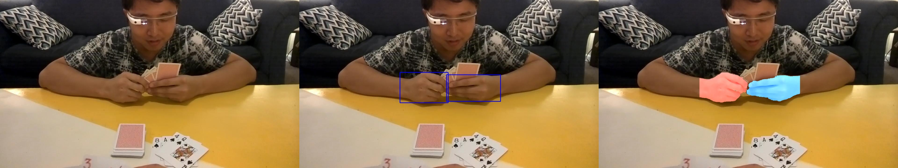

| 01.jpg |  |
|---|---|
| Pixel accuracy | 0.991440 |
| IOU (hand 1) | 0.829354 |
| IOU (hand 2) | 0.884960 |

----

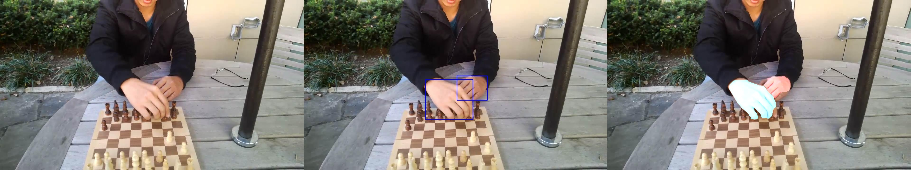

| 02.jpg |  |
|---|---|
| Pixel accuracy | 0.995538 |
| IOU (hand 1) | 0.944244 |
| IOU (hand 2) | 0.882239 |

----

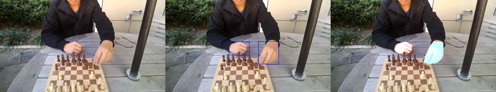

| 03.jpg |  |
|---|---|
| Pixel accuracy | 0.995691 |
| IOU (hand 1) | 0.942019 |
| IOU (hand 2) | 0.932831 |

----

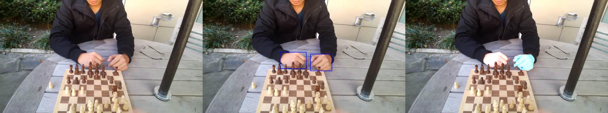

| 04.jpg |  |
|---|---|
| Pixel accuracy | 0.995994 |
| IOU (hand 1) | 0.941958 |
| IOU (hand 2) | 0.936200 |

----

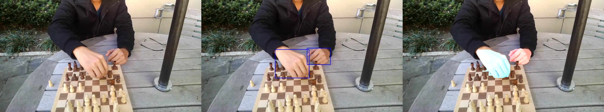

| 05.jpg |  |
|---|---|
| Pixel accuracy | 0.995340 |
| IOU (hand 1) | 0.873500 |
| IOU (hand 2) | 0.877507 |

----

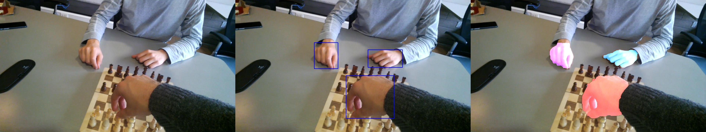

| 06.jpg |  |
|---|---|
| Pixel accuracy | 0.990544 |
| IOU (hand 1) | 0.873944 |
| IOU (hand 2) | 0.889280 |
| IOU (hand 3) | 0.928053 |

----

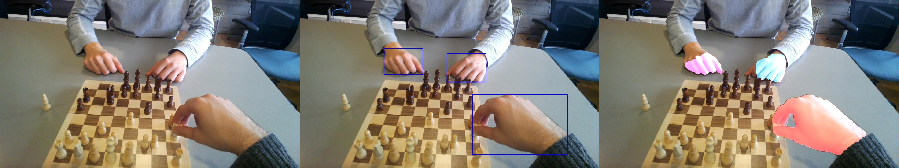

| 07.jpg |  |
|---|---|
| Pixel accuracy | 0.985010 |
| IOU (hand 1) | 0.771126 |
| IOU (hand 2) | 0.846182 |
| IOU (hand 3) | 0.941221 |

----

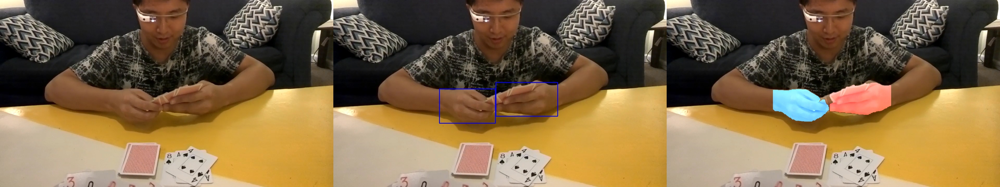

| 08.jpg |  |
|---|---|
| Pixel accuracy | 0.988653 |
| IOU (hand 1) | 0.831083 |
| IOU (hand 2) | 0.906601 |

----

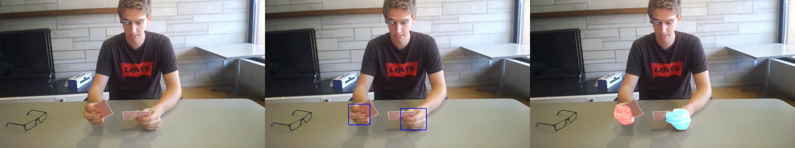

| 09.jpg |  |
|---|---|
| Pixel accuracy | 0.995507 |
| IOU (hand 1) | 0.804862 |
| IOU (hand 2) | 0.772343 |

----

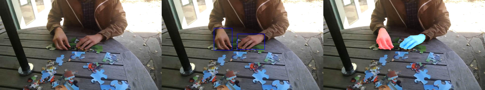

| 10.jpg |  |
|---|---|
| Pixel accuracy | 0.994219 |
| IOU (hand 1) | 0.872850 |
| IOU (hand 2) | 0.897257 |

----

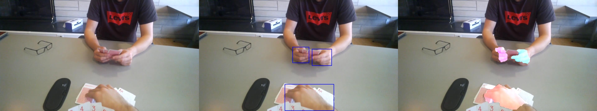

| 11.jpg |  |
|---|---|
| Pixel accuracy | 0.983394 |
| IOU (hand 1) | 0.822027 |
| IOU (hand 2) | 0.859609 |
| IOU (hand 3) | 0.869155 |

----

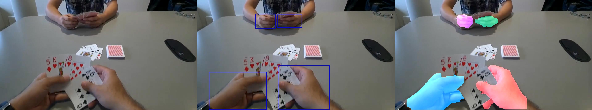

| 12.jpg |  |
|---|---|
| Pixel accuracy | 0.968104 |
| IOU (hand 1) | 0.939372 |
| IOU (hand 2) | 0.742011 |
| IOU (hand 3) | 0.857597 |
| IOU (hand 4) | 0.937695 |

----

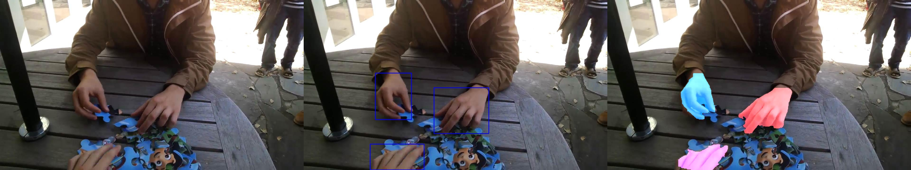

| 13.jpg |  |
|---|---|
| Pixel accuracy | 0.986934 |
| IOU (hand 1) | 0.922360 |
| IOU (hand 2) | 0.952820 |
| IOU (hand 3) | 0.941224 |

----

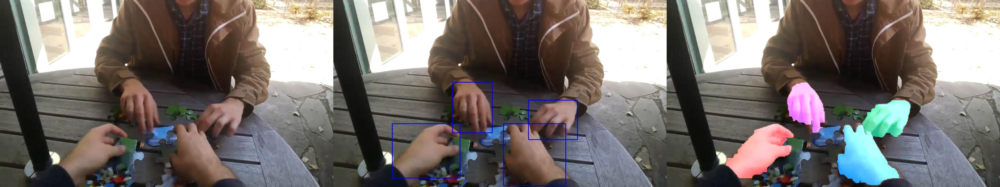

| 14.jpg |  |
|---|---|
| Pixel accuracy | 0.977371 |
| IOU (hand 1) | 0.843052 |
| IOU (hand 2) | 0.973763 |
| IOU (hand 3) | 0.750103 |
| IOU (hand 4) | 0.849622 |

----

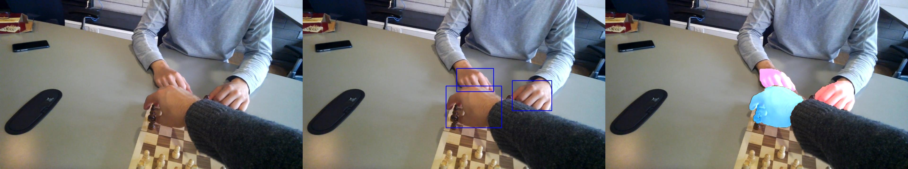

| 15.jpg |  |
|---|---|
| Pixel accuracy | 0.987554 |
| IOU (hand 1) | 0.846766 |
| IOU (hand 2) | 0.778655 |
| IOU (hand 3) | 0.874001 |

----

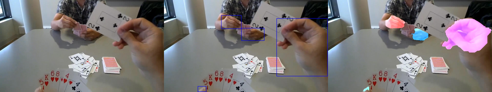

| 16.jpg |  |
|---|---|
| Pixel accuracy | 0.938699 |
| IOU (hand 1) | 0.796620 |
| IOU (hand 2) | 0.865642 |
| IOU (hand 3) | 0.759062 |
| IOU (hand 4) | 0.940069 |

----

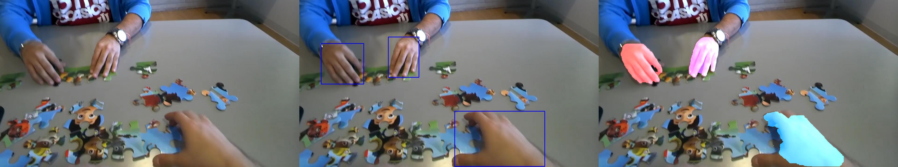

| 17.jpg |  |
|---|---|
| Pixel accuracy | 0.981412 |
| IOU (hand 1) | 0.941428 |
| IOU (hand 2) | 0.894777 |
| IOU (hand 3) | 0.883484 |

----

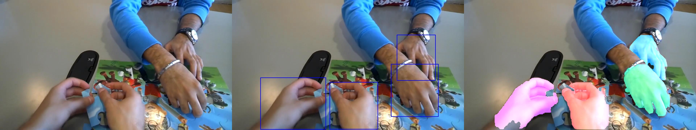

| 18.jpg |  |
|---|---|
| Pixel accuracy | 0.977409 |
| IOU (hand 1) | 0.955960 |
| IOU (hand 2) | 0.941146 |
| IOU (hand 3) | 0.953209 |
| IOU (hand 4) | 0.949174 |

----

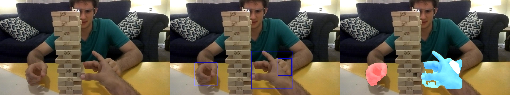

| 19.jpg |  |
|---|---|
| Pixel accuracy | 0.98178 |
| IOU (hand 1) | 0.933883 |
| IOU (hand 2) | 0.914439 |
| IOU (hand 3) | 0.766931 |

----

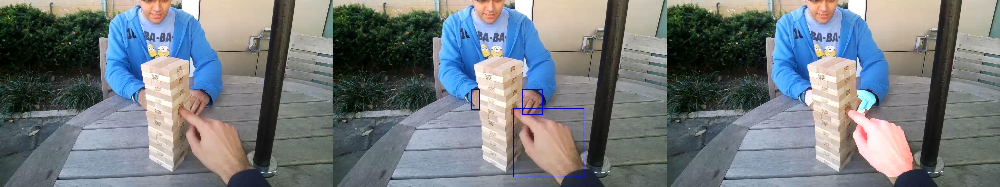

| 20.jpg |  |
|---|---|
| Pixel accuracy | 0.991144 |
| IOU (hand 1) | 0.479327 |
| IOU (hand 2) | 0.913141 |
| IOU (hand 3) | 0.880752 |

----


| 21.jpg |  |
|---|---|
| Pixel accuracy | 0.995105 |
| IOU (hand 1) | 0.912831 |

----


| 22.jpg |  |
|---|---|
| Pixel accuracy | 0.975634 |
| IOU (hand 1) | 0.634222 |
| IOU (hand 2) | 0.882807 |

----


| 23.jpg |  |
|---|---|
| Pixel accuracy | 0.990319 |
| IOU (hand 1) | 0.803485 |

----


| 24.jpg |  |
|---|---|
| Pixel accuracy | 0.979444 |
| IOU (hand 1) | 0.740882 |

----

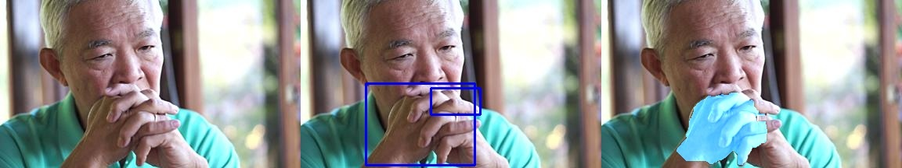

| 25.jpg |  |
|---|---|
| Pixel accuracy | 0.945385 |
| IOU (hand 1) | 0.815366 |
| IOU (hand 2) | 0.154515 |

----


| 26.jpg |  |
|---|---|
| Pixel accuracy | 0.987184 |
| IOU (hand 1) | 0.912963 |

----


| 27.jpg |  |
|---|---|
| Pixel accuracy | 0.971017 |
| IOU (hand 1) | 0.771726 |
| IOU (hand 2) | 0.747626 |

----

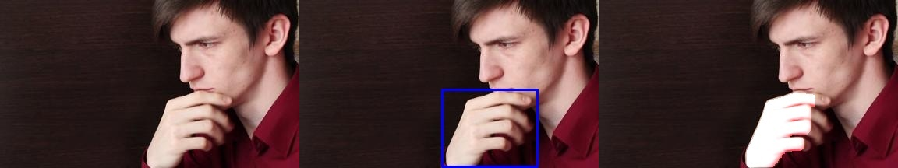

| 28.jpg |  |
|---|---|
| Pixel accuracy | 0.974573 |
| IOU (hand 1) | 0.899952 |

----


| 29.jpg |  |
|---|---|
| Pixel accuracy | 0.986099 |
| IOU (hand 1) | 0.858102 |

----


| 30.jpg |  |
|---|---|
| Pixel accuracy | 0.990391 |
| IOU (hand 1) | 0.892569 |

----

Summary of the results metrics:

| Metric | Mean |
|---|---|
| Pixel accuracy | 0.9832296 |
| IOU | 0.8541382 |


# Work organization

The project is developed by Zaccaria Valentina and Zanardo Damiano. In the final program the detection parts (including the training process, the detection, the visualization of results and the evaluation of the IoU metric) are developed by Damiano Zanardo. The segmentation parts, including visualization of results, are developed by Zaccaria Valentina. The implementation of the Pixel Accuracy Metric is by both Zanardo Damiano and Zaccaria Valentina. 
The code refactoring is by Damiano Zanardo. 

Hours of work per person: about 140h.

[^yolo]: [https://github.com/ultralytics/yolov5](https://github.com/ultralytics/yolov5)
[^egohands]: [http://vision.soic.indiana.edu/projects/egohands/](http://vision.soic.indiana.edu/projects/egohands/)
[^hof]: [https://drive.google.com/file/d/1hHUvINGICvOGcaDgA5zMbzAIUv7ewDd3/](https://drive.google.com/file/d/1hHUvINGICvOGcaDgA5zMbzAIUv7ewDd3/)
[^gtea]: [https://cbs.ic.gatech.edu/fpv/](https://cbs.ic.gatech.edu/fpv/)
[^caltech]: [http://host.robots.ox.ac.uk/pascal/VOC/databases.html#Caltech](http://host.robots.ox.ac.uk/pascal/VOC/databases.html#Caltech)
[^vlm]: [https://sites.google.com/view/sghanem/vlm-handoverface](https://sites.google.com/view/sghanem/vlm-handoverface)
[^colab]: [https://colab.research.google.com/drive/1In03n_uRMvx8z6clgnetsagocY12O1ai?usp=sharing](https://colab.research.google.com/drive/1In03n_uRMvx8z6clgnetsagocY12O1ai?usp=sharing)
[^tl]: [https://web.archive.org/web/20070801120743/http://cpms.byu.edu/springresearch/abstract-entry?id=861](https://web.archive.org/web/20070801120743/http://cpms.byu.edu/springresearch/abstract-entry?id=861)
[^grabcut]: [https://www.microsoft.com/en-us/research/wp-content/uploads/2004/08/siggraph04-grabcut.pdf](https://www.microsoft.com/en-us/research/wp-content/uploads/2004/08/siggraph04-grabcut.pdf)
[^grabcut-opencv]: [https://docs.opencv.org/3.4/d8/d83/tutorial_py_grabcut.html](https://docs.opencv.org/3.4/d8/d83/tutorial_py_grabcut.html)
[^skin-threshold]: [https://www.researchgate.net/publication/311402007_Skin_Color_Segmentation_Using_Multi-Color_Space_Threshold](https://www.researchgate.net/publication/311402007_Skin_Color_Segmentation_Using_Multi-Color_Space_Threshold)
[^canny]: [https://pyimagesearch.com/2015/04/06/zero-parameter-automatic-canny-edge-detection-with-python-and-opencv/](https://pyimagesearch.com/2015/04/06/zero-parameter-automatic-canny-edge-detection-with-python-and-opencv/)